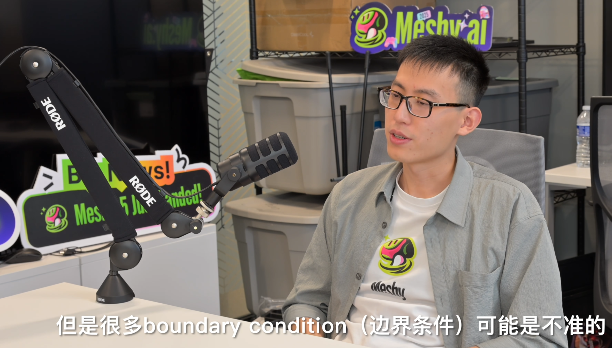

ICRA的最后一场debate给了一场还是很有意义的topic的，关于数据是否能支持一切事情。当然这场debate发在science robotics上的观点有点过于柔和了，大部分人基本上都还是承认modeling的作用的同时去说data确实是未来吧。

但是我想引申一下这个话题，关于simulation和data-driven。这个话题的由来是前端时间看whynottv里面关于胡渊鸣的一个访谈，里面就提到过关于下一代仿真的事，我觉得还是挺有意思的。所以就想就这个话题干脆探讨一下我的见解。

首先在这个话题之前，我想探讨一个比较哲学的问题，就是关于什么是"智能"(Intelligent)。在高中的时候我其实就想过一些问题，最大的问题在于，人是真正的智能体吗？我认为从理工科的角度这是毫无疑问的，因为你永远没有办法用一个方程组来描述人的行动，但是从哲学角度，人真的有自由意志吗？在给伟大的印度诗人泰戈尔的信中，爱因斯坦写到： 如果月亮在其环绕地球的永恒运动总被赋予自我意识，他就会完全确信，它是按照自己的决定在其轨道上一直运行下去。 这样，会有一个具有更高的洞察力和更完备智力的存在物，注视着人和人的所作所为，嘲笑人以为他按照自己的自由意志而行动的错觉。这其实就牵扯到更多哲学关于"确定性"的探讨了，先说我的观点，我认为这个世界是"确定"的。也就是说在一个给定的已知条件下，这个世界是可以被模拟的——即使这个模拟的准则受到量子力学"概率"的影响，我认为这个概率的影响并不能说明自由意志的存在，他只是一种模拟中引入的随机数而已。换而言之，从一个状态A有50%的概率会变成状态B，有50%状态变成状态C，这个概率并不会遵从A状态中的某些个体而变化。因而我认为这个世界是确定的，第一性原理是这个世界无可动摇的原理。

那回归到我们关于"智能"的探讨。如果人是非智能的，那么什么是智能？我想我们得被迫采用一种很不优美的定义，也就是将人这种处理多样任务的能力定义为智能，而比人处理任务更加低级的则不能称之为智能。这是一个很实用主义的定义，他否定了智能作为"质变"的部分，而只保留了"量变"的部分。这也是我的观点之一，我们稍后就会提到。

ok，让我们先把关于智能的讨论放到一边，我们来讨论一下人工智能的发展。有很多前置的知识我相信绝大部分都可以从科普读物或是选修课中了解到，像是什么符号主义之类的。这里我想着重讨论一下chatgpt，这个被认为划时代的东西。我认为chatgpt就是一个里程碑——他代表着AGI的可实现，代表着scaling law的成功。我认为chatgpt所展示出来的智能性是惊人的，但他使用的东西确实原始的（这当然并不是说transformer是一个原始的东西，我指的是人们在用朴素的数学和网络结构去模拟出了智能，这和原始人用木棍作出了汽车一样震撼）。所以说智能只是一个数学带来的假象——人们只是没有办法解释，而不是没有办法制作，换而言之这只是一种类似混沌系统的东西。所以说智能是能被很轻易的制作的，当然这只是理论层面，技术层面这当然十分困难。

那么回到这篇文章的主体：data or rule？这其实就是一个方法论的问题了，现在我们已经知道了，理论层面的智能只是一个复杂的系统，我们应该用什么方法去还原这个系统？data和rule事实上就是两个方案了，data要的是一个拟合，要的是一个能在"我们的世界"能被使用的东西。而rule要的则是一个真的智能，尽管他不一定能在"我们的世界"被使用。前段时间在[潘梓正](https://www.zhihu.com/people/hspzz)学长的讲座的时候他就提到过，ai训练本质上是一种柏拉图的洞穴问题，ai被困在一个柏拉图洞穴中，这里终究和现实是有一个区别的，因而data永远不可能完全做到创世神的状态。但是问题是，我们真的需要一个创世神吗？其实人的智能本质上也是一个data驱动的不是吗，你只是在不断通过自己的方式去搜索data然后训练，这和现在具身相关的东西很像，但还是一个data的东西。所以data是可以被应用的，data是可以诞生智能的，data是可以落地的。

但是rule要做的就是一个很庞大的工程了——rule要创造一个世界。很多现在的rule的想法是，我们把这个世界的第一性原理搬到simulation里，但是这个就不现实，因为我们连自己世界的物理原则都没搞清楚，就算搞清楚了，我们也不会有这么巨大的算力去计算粒子层面的东西。所以rule的本质是在创造另一个与现实世界相似的世界，那里也许有更加简单、粗糙的第一性原则，但是也许有一天在那里也能诞生出智慧。

扯的有点远了，最后说一下一个我的观点吧，我认为data是实用主义的，rule是一个目前技术达不到的东西，过去rule-based的东西本质上不是在做智慧相关的东西，只是作为一种工具而非思维去做。现在的算力还不支持创造出一个能诞生智慧的世界，但是我相信或许会有这一天。

